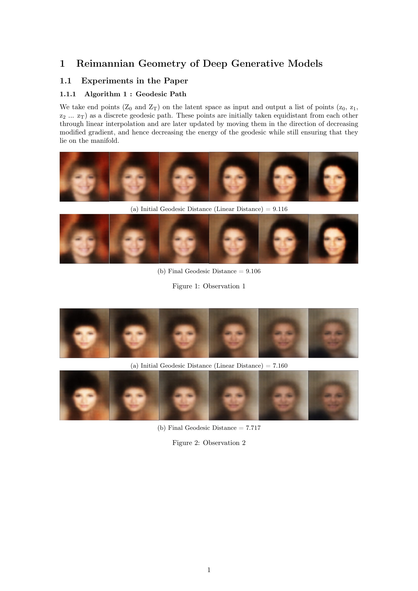
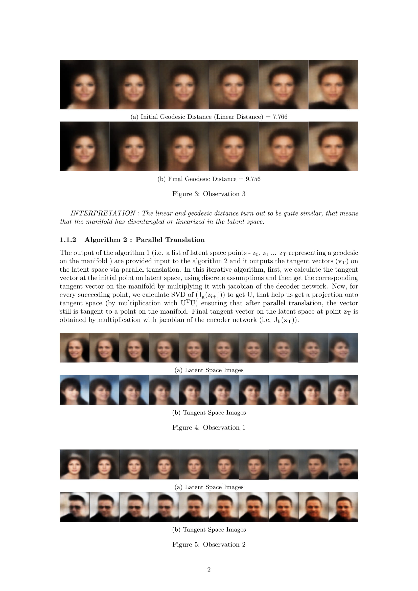
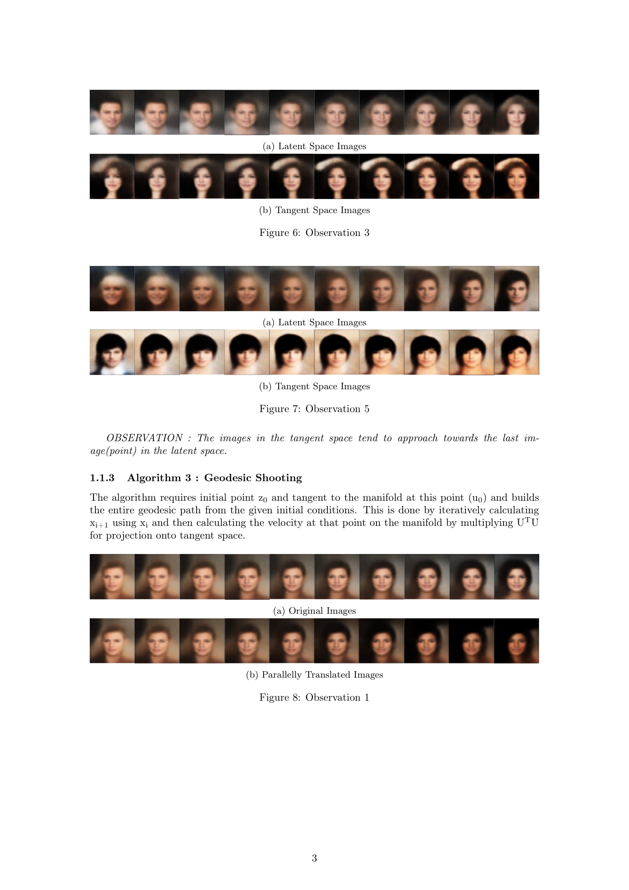
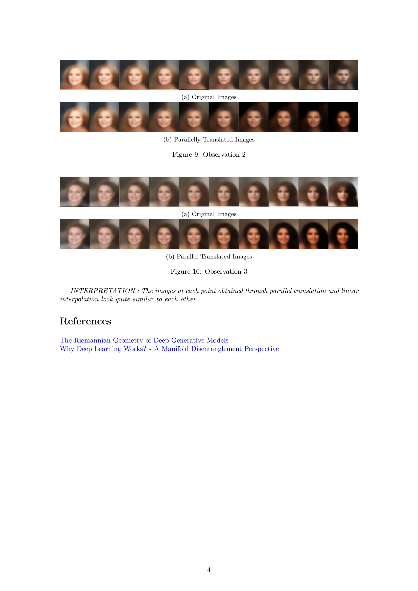

# Riemannian Geometry of Deep Generative Models

This work was done by Sarthak Bhagat and Shagun Uppal in their B.Tech Thesis under Prof. Saket Anand.
<br>
<br>
This repository provides partial implementation of our paper <a href="https://arxiv.org/abs/1902.06964">Geometry of Deep Generative Models for Disentangled Representations</a>.
This repository also provides a basic implementation of the paper <a href="https://arxiv.org/abs/1711.08014">Riemannian Geometry of Deep Generative Models</a> on MNIST as well as CelebA.
<br>
<br>
If you find this code useful in your research, don't forget to cite:
```
@article{Shukla2019GeometryOD,
  title={Geometry of Deep Generative Models for Disentangled Representations},
  author={Ankita Shukla and Suresh Uppal and Sarthak Bhagat and Saket Anand and Pavan K. Turaga},
  journal={ArXiv},
  year={2019},
  volume={abs/1902.06964}
}
```

## Requirements 
1) Python 2/3
2) Pytorch
3) Tensorboard
4) Tensorflow
5) Cmake
6) ONNX

## Steps to install ONNX
```
git clone https://github.com/onnx/onnx.git
cd onnx
git submodule update --init
python setup.py install
```

## Results






